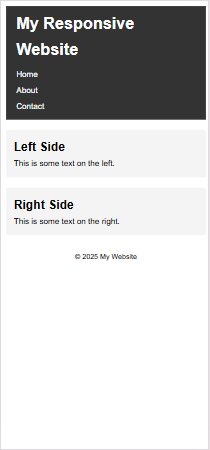

# 📱 Responsive Website Task - Internship Task 4-2

This is a simple responsive webpage created as part of **Web Development Internship Task 4-2**.

## ✅ Features
- Responsive layout using **CSS Flexbox**
- Media queries for mobile view (`max-width: 768px`)
- Vertical stacking of content on smaller screens
- Clean and minimal design

## 📂 Technologies Used
- HTML5
- CSS3

## 🖥️ Desktop View
- Two-column layout with header and footer

## 📱 Mobile View
- Stacked layout
- Navigation links stack vertically
- Optimized padding and spacing

## 📸 Screenshots

